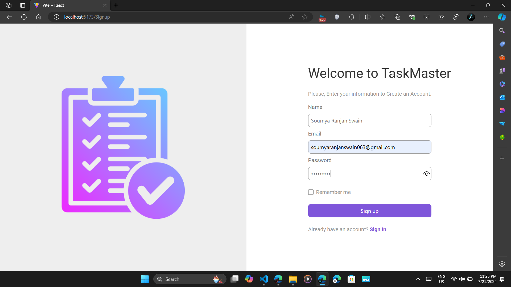
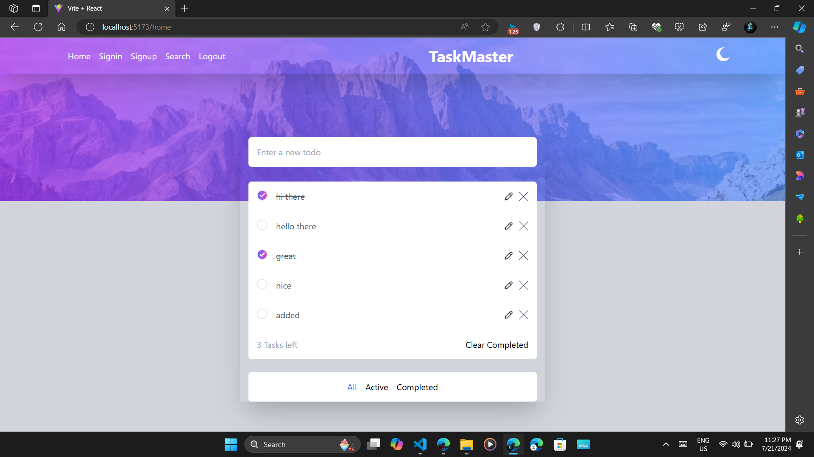
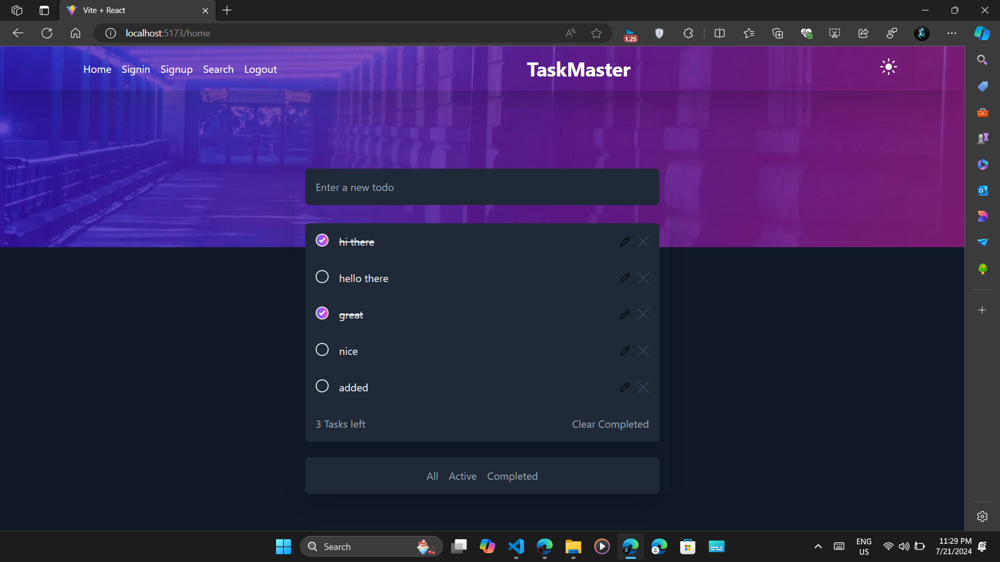
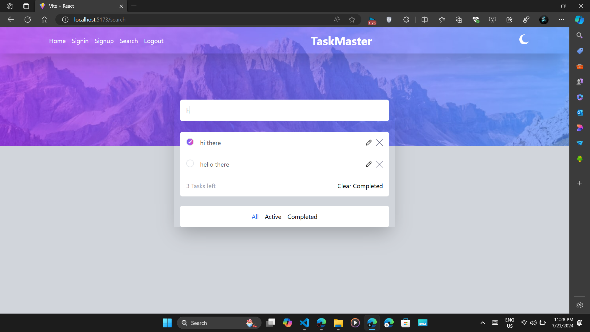

# TaskMaster
## A simple Todo App created using React, Tailwind

### It has the following functionalities:

#### Authentication and Authorization
- you can login and logout, and you can access functionality of homepage, search page only if you are authenticated
)

#### Add Task
- you can add tasks

#### Black and light themes
- you can switch between 2 different themes

#### Search
- you can search for a todo

#### Remove Task
- you can remove a todo

#### Update Task
- you can update the todo

#### Mark Task as Done
- you can mark the tasks you did, and you can also clear them

#### Filters
- like all todos, completed todos, uncompleted todos

